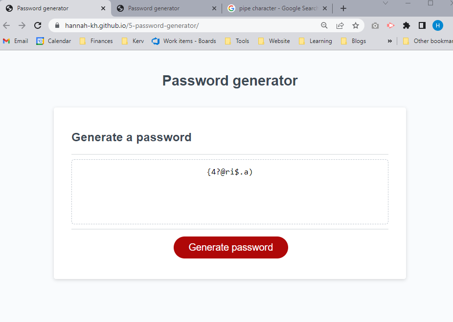

# 5-password-generator
## Description

The purpose of this project was to generate a password based on criteria selected by the user. On selecting the 'Generate password' button, the user is prompted to choose the password length, and whether they want to include:
- numbers
- lower cased characters
- upper cased characters
- special characters

## Installation

N/A

## Usage

[Deployed application](https://hannah-kh.github.io/5-password-generator/).

Select the 'Generate password' button and choose your criteria. You can also inspect the page to check what's happening in the console.

## Credits

N/A

## License

Refer to the LICENSE in the repo.

---